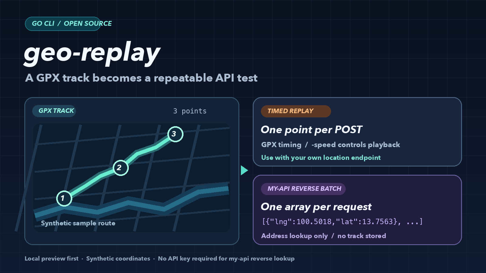
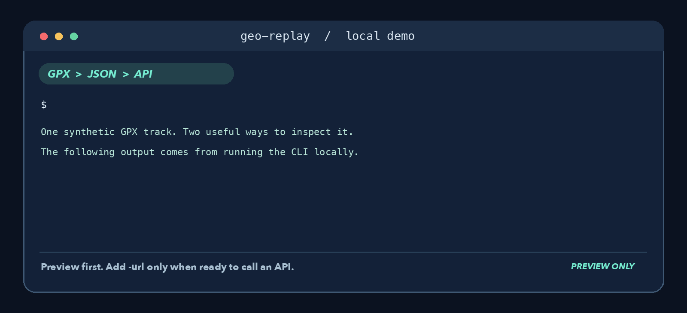
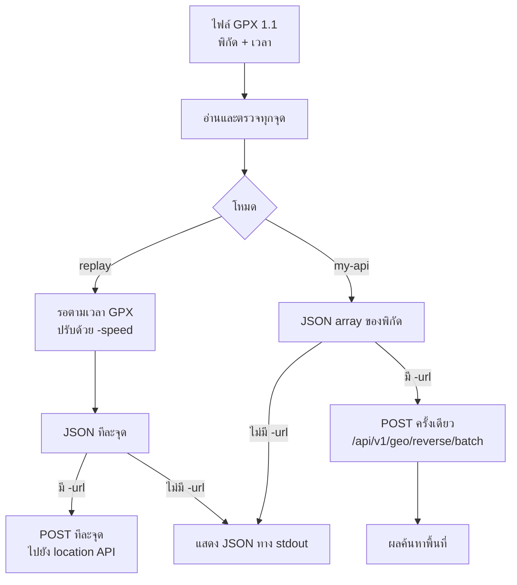

# geo-replay

**geo-replay** คือโปรแกรมบรรทัดคำสั่ง (CLI) ที่อ่านเส้นทางจากไฟล์ GPX 1.1 แล้วแปลงพิกัดเป็น JSON เพื่อทดสอบ API โดยไม่ต้องเดินทางตามเส้นทางจริง ใช้เส้นทางเดิมเล่นซ้ำเพื่อไล่บั๊กด้านตำแหน่ง ปรับความเร็วในการทดสอบ และดู payload ก่อนส่งจริงได้ มีไฟล์ตัวอย่างสังเคราะห์ใน repo ให้ลองทันที



## ใช้ทำอะไร

| โหมด | โปรแกรมทำอะไร | เหมาะกับ |
| --- | --- | --- |
| `replay` (ค่าเริ่มต้น) | ส่ง `POST` ทีละจุดตามช่วงเวลาที่บันทึกใน GPX; `-speed` ย่นเวลาได้ | ทดสอบ endpoint รับตำแหน่ง, ลำดับเหตุการณ์ และหน้าจอที่ติดตามตำแหน่ง |
| `my-api` | ส่งพิกัดทั้งหมดครั้งเดียวไปยัง reverse geocode ของ `my-api` เพื่อดูข้อมูลพื้นที่ของแต่ละจุด | ตรวจว่าพิกัดในเส้นทางตรงกับจังหวัด/อำเภอ/ตำบลใด |

ถ้าไม่ใส่ `-url` ทั้งสองโหมดจะแสดง JSON ที่จะส่งทางหน้าจอ จึงตรวจข้อมูลได้ก่อนเรียก API ส่วนโหมด `my-api` เป็นการ **ค้นหาพื้นที่** ไม่เล่นตามเวลาและไม่สร้างประวัติการเดินทางใน `my-api`



## ข้อมูลไหลอย่างไร



## เริ่มใช้

ต้องมี Go 1.22 ขึ้นไป คำสั่ง `go run` ด้านล่างใช้ได้บน macOS, Linux และ Windows โดยรันจากโฟลเดอร์โปรเจกต์นี้

```sh
# ดู JSON ที่จะส่งก่อน โดยไม่เรียก API
go run . -file testdata/sample.gpx -speed 60

# ส่งแต่ละจุดด้วย HTTP POST ไปยัง endpoint รับตำแหน่งของคุณ
go run . -file testdata/sample.gpx -speed 60 -url http://localhost:8080/locations
```

ตัวอย่าง `localhost:8080/locations` ต้องเป็น endpoint ที่คุณเปิดเอง; `my-api` ไม่มี endpoint รับตำแหน่งนี้ ตัวเลือก `-speed 60` หมายถึงเวลาใน GPX 60 วินาทีจะใช้เวลาเล่นจริง 1 วินาที ค่าเริ่มต้นคือ `1` (เวลาเท่าต้นฉบับ) ถ้าไม่ใส่ `-url` โปรแกรมจะเขียน JSON หนึ่งบรรทัดต่อจุดลง stdout

เมื่อใส่ `-url` โปรแกรมส่ง `POST` พร้อม `Content-Type: application/json` โดยมี body รูปแบบนี้:

```json
{"latitude":13.7563,"longitude":100.5018,"timestamp":"2026-10-02T14:00:00Z"}
```

`timestamp` คือเวลาส่งจริงใน UTC; เวลาใน GPX ใช้กำหนดจังหวะส่งเท่านั้น จึงใช้ไฟล์ตัวอย่างเก่าทดสอบระบบที่ตรวจความสดของข้อมูลได้

## ใช้กับ my-api

โหมดนี้ส่งพิกัดไปยัง API สำหรับ **reverse geocode** เพื่อค้นหาข้อมูลพื้นที่ ไม่บันทึก track และไม่เล่นตามเวลาใน GPX จึงไม่ต้องใส่ `-speed`

```sh
# ดู body ที่จะส่งก่อน: JSON array หนึ่งชุด
go run . -file testdata/sample.gpx -mode my-api

# ส่ง POST ครั้งเดียวไปยัง my-api ที่รันในเครื่อง แล้วแสดง response JSON ทาง stdout
go run . -file testdata/sample.gpx -mode my-api -url http://127.0.0.1:8080/api/v1/geo/reverse/batch
```

body มีรูปแบบ `[{"lng":100.5018,"lat":13.7563}]` ไม่มี `timestamp` โหมดนี้รับ 1–1000 จุด โดยทุกจุดต้องอยู่ในกรอบประเทศไทย (`lat` 5–21, `lng` 97–106) API จำกัด 10 requests/นาที/IP และต้องเปิด GeoDB ใน `my-api` จึงจะมี endpoint นี้ ไม่ต้องใช้ Authorization header หรือ API key

## ขอบเขตรุ่นแรก

- อ่านเฉพาะ `trk/trkseg/trkpt` ใน GPX 1.1; ไม่เล่น waypoint หรือ route point
- ทุกจุดต้องมีพิกัดและเวลาแบบ RFC3339 พร้อม `Z` หรือ timezone offset และเวลาต้องไม่ย้อนกลับ แม้ไฟล์จะมีหลาย track
- ตรวจไฟล์ทั้งไฟล์ก่อนส่งจุดแรก จำกัดขนาด GPX ที่ 32 MiB
- โหมดปกติส่งตามลำดับและรอโดยอิงเวลาจุดแรก จึงไม่สะสมความหน่วงจาก HTTP
- ตอบกลับ HTTP 2xx ถือว่าสำเร็จ; หยุดทันทีเมื่อผิดพลาด ไม่ retry เพื่อเลี่ยงการส่งจุดซ้ำ
- กำหนด timeout ต่อ HTTP request 10 วินาทีในโหมดปกติ และ 20 วินาทีในโหมด `my-api`; ไม่ตาม redirect

**ข้อมูลตำแหน่งอาจละเอียดอ่อน:** เริ่มด้วยไฟล์สังเคราะห์และโหมด preview ก่อนส่งไปยัง API จริง อย่าใส่ token ใน URL หรือ commit track ของผู้ใช้ลง repo รุ่นนี้ยังไม่มีตัวเลือกส่ง Authorization header

## พัฒนา

```sh
go test ./...
go build .
```

โค้ดใช้ Go standard library เท่านั้น อ้างอิงรูปแบบไฟล์จาก [GPX 1.1](https://www.topografix.com/gpx/1/1/)
